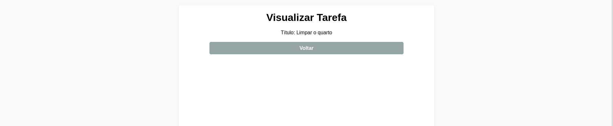
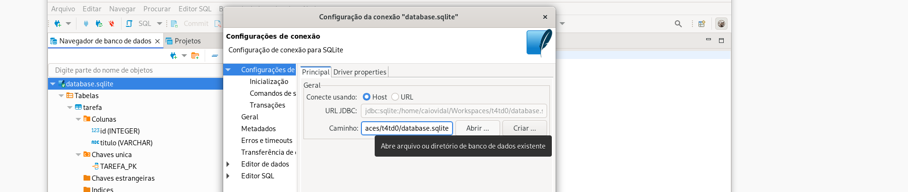

# 4T Todo - Lista de Tarefas

## 💻 Sobre o projeto


O 4T Todo trata-se de um projeto template para estágiarios da 4T Soluções se familiarizarem com nosso fluxo de trabalho, a respeito de desenvolvimento de software. O **4T TODO** é uma aplicação voltada a listagem de tarefas. Ele permite realizar a listagem das tarefas, cadastro das tarefas, visualização das tarefas, edição das tarefas e exclusão das tarefas.

---
<p align="center">
  
</p>
---

## ⚙️ Fucionalidades


**Listar Tarefas:** Exibir uma lista de todas as tarefas cadastradas no sistema, permitindo que o usuário visualize o que precisa ser feito.

**Cadastrar Tarefas:** Permitir que o usuário adicione novas tarefas ao sistema, inserindo um título para a tarefa e salvando ela no banco de dados.

**Visualizar Tarefa:** Ao selecionar uma tarefa da lista, o usuário pode ver os detalhes dessa tarefa, como o título.

**Editar Tarefa:** Dar a capacidade ao usuário de editar os detalhes de uma tarefa existente, como seu título, e salvar as alterações no banco de dados.

**Excluir Tarefa:** Permitir que o usuário remova uma tarefa específica da lista de tarefas. Ao excluir uma tarefa, ela é removida permanentemente do banco de dados.

**Salvar no Banco de Dados:** Todas as informações das tarefas são armazenadas de forma permanentemente em um banco de dados para que possam ser acessadas e modificadas posteriormente.

**Validação de Título:** Garantir que o título da tarefa seja obrigatório ao cadastrá-la no sistema, exibindo uma mensagem de erro caso o campo esteja em branco.

**Feedback de Ações:** Fornecer feedback ao usuário após realizar uma ação, como cadastrar, editar ou excluir uma tarefa, informando se a operação foi bem-sucedida ou não.

---

## 🎨 Layout

---

### Web

1. Lista de Tarefas
<p align="center">
  
</p>
---
2. Cadastro de Tarefas
<p align="center">
  
</p>
---
3. Visualizar Tarefas
<p align="center">
  
</p>
---
4. Editar Tarefas
<p align="center">
  
</p>
---
5. Excluir Tarefas
<p align="center">
  
</p>
---
6. Lista de Tarefas Cadastradas
<p align="center">
  
</p>
---

## 🛠 Tecnologias

- **Backend**:
    - **Java** com:
    - **Spring Boot**:
        - **Thymeleaf**
        - **Spring web**
        - **Devtools**
        - **Test**
        - **Hibernate**
    - **Maven**
        
- **Frontend**:
    - **Java** com:
        - **HTML5**
        - **CSS3**
- **Banco de Dados**:
    - **SQL** com:
        - **SQLite**
        - **Dbeaver**


---

## 🛣️ Como executar o projeto

Este projeto é divido em três partes:

- Backend (Java, Spring Boot, Maven) 

- Frontend (Html e Css)

- Banco de Dados (SQLite e Dbeaver)

---

### Pré-requisitos

Antes de começar, você vai precisar ter instalado em sua máquina as seguintes ferramentas: Git,Dbeaver,SQLite . Além disto é bom ter um editor para trabalhar com o código como VSCode
---

---
### Versões

- **java adoptopenjdk-21.0.1+12.0.LTS**
- **maven 3.9.6**
- **spring boot 3.2.5**
- **sqlite-jdbc 3.36.0.1**
- **dbeaver 24.0.4**


Instale as versões acima para executar o projeto
---

---

#### Iniciando o Backend (terminal)

```bash

# Crie a uma pasta em chamada t4td0
$ mkdir t4td0

# Acesse a pasta do projeto no terminal/cmd
$ cd t4td0

# Clone este repositório
$ git clone git@github.com:cubos-academy/academy-template-readme-projects.git

# Execute o comando (Apos paarmetrização do Banco de Dados)
$ mvn spring-boot:run

# O servidor inciará na porta 8080 - acesse http://localhost:8080/tarefas/

```
---
<p align="center">
  
</p>
---

#### Iniciando e Parametrizando o Banco de Dados (sqlite e dbeaver)

```bash

#Instale a versão mais recente do SQLite

#Instale a versão mais recente do Dbeaver

#Entre no Dbeaver, crie uma nova conexão e escolha banco SQLite

#Crie um banco chamado database.sqlite

#Copie a url do banco database.sqlite criado

# Abra seu editor de codigo no projeto t4td0

# Entre na pasta application.properties 
$ t4td0/src/main/resources/application.properties 

# Altere o caminho do banco para o encontrado no dbeaver
$ spring.datasource.url=jdbc:sqlite:/home/caiovidal/Workspaces/t4td0/database.sqlite

```
---
<p align="center">
  
</p>
---

#### Iniciando a aplicação web (localhost)

```bash

# Apos seguir o passo a passo e inicar o Spring Boot no terminal executando o comando 
$ mvn spring-boot:run

# Abra seu navegador 

# O servidor inciará na porta 8080 - acesse http://localhost:8080/tarefas/

```
---
<p align="center">
  
</p>
---

## 🛠 Testes Automatizados

---

## 📝 Autor 

Feito por Caio Vidal [Entre em contato!](https://www.linkedin.com/in/caio-nobre-vidal-silva-23669b270/)


