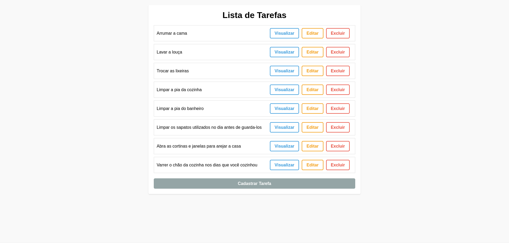

# 4T Todo - Lista de Tarefas

## 💻 Sobre o projeto

O 4T Todo trata-se de um projeto template para estágiarios da 4T Soluções se familiarizarem com nosso fluxo de trabalho, a respeito de desenvolvimento de software. O **4T TODO** é uma aplicação voltada a listagem de tarefas. Ele permite realizar listar, cadastrar, visualizar, editar e excluir tarefas.

---

## ⚙️ Fucionalidades

---

## 🎨 Layout

---

### Web

  

---

## 🛣️ Como executar o projeto

---

### Pré-requisitos

---

#### 🧭 Rodando a aplicação web 

---

## 🛠 Tecnologias

---

## 📝 Autor 

Feito por Caio Vidal [Entre em contato!](https://www.linkedin.com/in/CaioNobreVidalSilva/)

